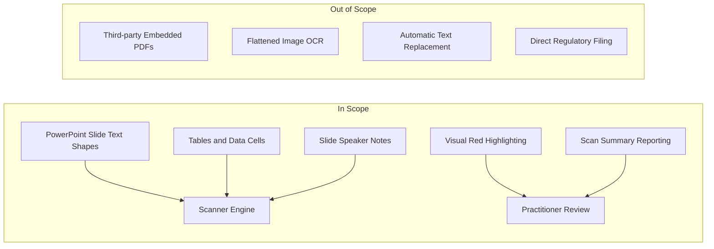
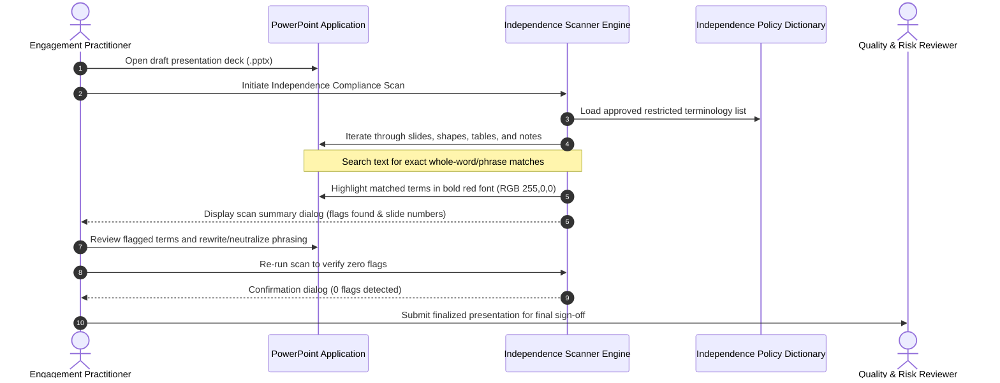

# Business Requirements Document (BRD)

**Project Name:** Automated PowerPoint Independence Compliance Scanner
---
## 1. Document Conventions

This document adheres to the standard requirment specifications defined in RFC 2119:

* **SHALL / MUST:** Signifies an absolute, mandatory requirement for the solution.
* **SHOULD:** Signifies a recommended requirement where valid reasons may exist in particular circumstances to ignore, but the full implications must be understood and weighed.
* **MAY:** Signifies a truly optional requirement.          
* **Priority Framework:** Requirements are categorized using the MoSCoW prioritization model (**Must Have**, **Should Have**, **Could Have**, **Won't Have** for initial release).
---
## 2. Executive Summary

### 2.1 Project Purpose
The purpose of the Automated PowerPoint Independence Compliance Scanner initiative is to provide engagement and proposal teams at the consulting firm with an automated, pre-issuance quality assurance mechanism. The solution identifies, flags, and visually highlights terminology within client-facing PowerPoint deliverables and pitch decks that could violate or compromise the consulting firm's regulatory and firm-mandated auditor independence policies.

### 2.2 Background
As a leading professional services firm subject to oversight by regulatory bodies—including the US Securities and Exchange Commission (SEC), the Canadian Public Accountability Board (CPAB), and the Chartered Professional Accountants (CPA) Code of Professional Conduct—the consulting firm enforces strict rules governing organizational independence.

Engagement teams, proposal developers, and practitioners frequently utilize Microsoft PowerPoint to draft proposals, engagement summaries, strategic recommendations, and client expected deliverables. Historically, checking these presentations for independence-sensitive phrasing (e.g., words implying management decision-making, direct control, legal advocacy, or non-permissible service guarantees) relied exclusively on manual reviews by engagement leaders and the National Independence Office.

### 2.3 Problem Statement

Manual compliance reviews of multi-slide presentations are labor-intensive, inconsistent, and prone to human oversight—particularly during high-pressure proposal cycles and tight deliverable deadlines. Missing a prohibited term or delivering language that implies an independence violation risks severe regulatory penalties, client relationship strain, reputational damage, and costly rework. An automated, lightweight, in-situ screening tool embedded directly within practitioner presentation workflows is required to safeguard firm compliance prior to external distribution.

---
## 3. Business Goals & Objectives

### 3.1 Business Goals
* **Mitigate Regulatory and Independence Risk:** Prevent non-compliant language from reaching audit clients or prospective clients, ensuring 100% adherence to global and national independence policies.
* **Accelerate Deliverable Turnaround:** Drastically decrease practitioner and quality reviewer cycle time spent on manual line-by-line proofing of slide decks for restricted phrasing.
* **Standardize Independence Governance:** Provide a consistent, centralized dictionary of prohibited and sensitive terms aligned with Quality & Risk Management (QRM) guidelines.

### 3.2 Key Performance Indicators (KPIs) & Success Metrics

| Metric ID | KPI / Objective Description | Baseline (Manual Review) | Target (Automated Scanner) |
| :--- | :--- | :--- | :--- |
| **KPI-01** | Terminology Flagging Accuracy | ~70% manual recall | >= 98% detection of defined restricted terms |
| **KPI-02** | Review Turnaround Time per 50-Slide Deck | 45–60 minutes | < 30 seconds execution time |
| **KPI-03** | Deliverable Compliance Rate at Final Sign-Off | Variable; repeated revisions | >= 95% pass rate on initial QRM submission |
| **KPI-04** | Independence Escalation Reductions | Frequent avoidable escalations | 75% reduction in terminology-related escalations |

## 4. Project Scope

### 4.1 In-Scope Capabilities
* Scanning native Microsoft PowerPoint presentations (`.pptx`, `.pptm`) active within the desktop environment.
* Processing all presentation slides, including text frames, shapes, multi-level bulleted lists, tables, callout boxes, and speaker notes.
* Comparing presentation text against an approved taxonomy of restricted words and independence risk phrases.
* Applying distinct visual formatting (highlighting matched restricted words in prominent red text/font color) to signal non-compliance to the user.
* Providing an executive summary dialog/report indicating total slides analyzed, number of independence risk terms detected, and specific slide locations.
* Supporting localized terminology updates maintained by Risk & Regulatory compliance leads.

### 4.2 Out-of-Scope Capabilities
* Automatic replacement or auto-correction of flagged terms without author review (to preserve authorial context and intent).
* Scanning external linked documents, embedded video/audio files, or non-native embedded OLE objects.
* Optical Character Recognition (OCR) of flattened bitmap raster images or external diagrams embedded within slides.
* Integration with external client-facing enterprise portals or real-time regulatory databases outside of the local firm workstation environment.
* Providing formal legal certification of compliance (the tool is a quality control aid, not a substitute for formal Independence clearance).
---
### 5. Stakeholders & Personas

| Stakeholder Group | Representative Role | Primary Responsibility / Influence | Key Interest in Solution |
| :--- | :--- | :--- | :--- |
| **Practice Practitioners & Consultants** | Consultant / Senior Consultant | Creates slide decks, RFP responses, and deliverables. | Needs fast, self-service feedback before submitting presentations for internal review. |
| **Engagement Managers & Senior Managers** | Engagement Manager / Proposal Lead | Oversees delivery quality, engagement budget, and timely submission. | Needs risk reduction and faster review cycles without bottlenecks. |
| **Quality & Risk Management (QRM) / Independence Office** | Independence Director / Ethics Officer | Defines and governs firm independence standards and regulatory compliance policies. | Requires reliable enforcement of policy dictionaries and zero tolerance for compliance breaches. |
| **Engagement Partners** | Lead Client Service Partner (LCSP) | Final sign-off authority and ultimate accountability to regulatory authorities. | Protects firm reputation, legal standing, and audit client licenses. |

### 6. Business Requirements
### 6.1 Scanning & Detection Requirements

| Req ID | Requirement Statement | MoSCoW Priority | Business Rule / Rationale |
| :--- | :--- | :--- | :--- |
| **BR-1.1** | The solution SHALL scan all slides within the active presentation from slide 1 through the final slide upon execution. | **Must Have** | Guarantees complete document coverage without omitting tail-end slides or appendix sections. |
| **BR-1.2** | The solution SHALL inspect text content across all native slide elements, including standard text boxes, grouped shapes, structured tables, and speaker notes. | **Must Have** | Independence breaches often occur in footnote disclosures, callout cards, and speaker remarks. |
| **BR-1.3** | The detection mechanism SHALL perform case-insensitive matching against the established dictionary of restricted terms. | **Must Have** | Independence terminology (e.g., "audit", "management responsibility", "guarantee") must be caught regardless of capitalization. |
| **BR-1.4** | The solution SHOULD identify both exact single-word matches and multi-word phrases (e.g., "act as management", "contingent fee", "advocate on behalf"). | **Should Have** | Contextual phrases are frequently where independence breaches occur rather than isolated single words. |
| **BR-1.5** | The solution SHALL support whole-word boundary matching to prevent false positives on substrings (e.g., flagging "management" should not trigger on "damagements"). | **Must Have** | Minimizes practitioner alert fatigue and prevents document formatting degradation. |

### 6.2 Visual Flagging & Output Requirements

| Req ID | Requirement Statement | MoSCoW Priority | Business Rule / Rationale |
| :--- | :--- | :--- | :--- |
| **BR-2.1** | The solution SHALL visually alter the font color of each detected prohibited word/phrase to pure red (RGB: 255, 0, 0) while preserving surrounding formatting. | **Must Have** | Red is the standard audit and review highlight color; immediate visual salience ensures flagged words are resolved prior to distribution. |
| **BR-2.2** | The solution SHOULD optionally apply bold styling to the flagged text to ensure accessibility and visibility across dark or colored background templates. | **Should Have** | Enhances visual contrast and readability for diverse presentation themes. |
| **BR-2.3** | The solution SHALL NOT alter or delete any underlying presentation content, paragraph styling, font family, or slide layout during the highlighting process. | **Must Have** | The integrity of client-ready typography and visual aesthetics must be strictly preserved. |
| **BR-2.4** | The solution SHALL display a post-scan executive summary dialog box upon completion, stating the total number of flagged items and the slides on which they occurred. | **Must Have** | Provides immediate confirmation of scan completion and directs reviewers to specific action points. |
| **BR-2.5** | The solution COULD generate an optional summary slide or clipboard report listing all detected terms, slide numbers, and contextual snippets. | **Could Have** | Facilitates team hand-offs and tracking during large proposal reviews. |

### 6.3 Governance, Terminology & Maintenance Requirements

| Req ID | Requirement Statement | MoSCoW Priority | Business Rule / Rationale |
| :--- | :--- | :--- | :--- |
| **BR-3.1** | The restricted term library SHALL reflect categories defined by the National Independence Office, including Management Functions, Advocacy, Contingent Remuneration, and Custody/Control. | **Must Have** | Direct alignment with regulatory statutes (PCAOB Rule 3520, SEC Rule 2-01). |
| **BR-3.2** | The solution SHALL allow designated compliance administrators to update, add, or deprecate flagged terms without requiring core script redesign. | **Must Have** | Regulatory policies evolve annually; the dictionary must remain modular and maintainable. |
| **BR-3.3** | The system SHOULD categorize flagged terms into two risk tiers: "Prohibited" (strict violations) and "Sensitive / Review Required" (context-dependent warnings). | **Should Have** | Enables nuanced review where certain terms may be acceptable under specific engagement types. |

### 6.4 Usability & Execution Environment Requirements

| Req ID | Requirement Statement | MoSCoW Priority | Business Rule / Rationale |
| :--- | :--- | :--- | :--- |
| **BR-4.1** | The solution SHALL be executable with one-click user action directly within standard enterprise desktop Microsoft PowerPoint installations. | **Must Have** | Minimal practitioner friction ensures high voluntary adoption across engagement teams. |
| **BR-4.2** | The execution SHALL require no external cloud connectivity, API tokens, or internet-based data exfiltration. | **Must Have** | Strict client confidentiality and data privacy policies forbid sending pre-issuance materials outside the local enterprise boundary. |
| **BR-4.3** | The solution SHOULD complete execution within 30 seconds for presentations containing up to 100 slides. | **Should Have** | Fast execution prevents disruption to practitioner workflow. |

### 7. Business Process Workflow

## 8. Assumptions, Constraints & Dependencies

### 8.1 Assumptions
1. Users have legitimate access to Microsoft PowerPoint with enabled macro execution permissions in accordance with firm IT security standards.
2. The user has finalized or nearly finalized the slide deck text before initiating the compliance scan.
3. The independence terminology dictionary provided by the Quality & Risk Management office is accurate, up to date, and vetted against current regulatory mandates.

### 8.2 Constraints
1. **No External Infrastructure:** The solution must operate self-contained on practitioner laptops without dedicated backend servers or third-party cloud integrations.
2. **Formatting Protection:** The scanner must not corrupt customized brand templates, master layouts, or proprietary typography.
3. **Execution Permissions:** Deployment must comply with the consulting firm's internal security perimeter policies regarding desktop automation scripts.

### 8.3 Dependencies
1. Availability and maintenance of the standardized Independence Restricted Terminology List by the National Independence Office.
2. Compatibility with Microsoft Office 365 / PowerPoint desktop client on Windows enterprise workstations.
---
## 9. Glossary of Terms

| Term | Definition |
| :--- | :--- |
| **Auditor Independence** | A core regulatory and ethical requirement that an accounting firm and its practitioners remain impartial, objective, and free from conflicts of interest or management responsibilities with respect to audit clients. |
| **Independence Policy** | Internal firm rules governing service offerings, contractual terms, marketing language, and client interactions to maintain regulatory compliance with SEC, PCAOB, CPAB, and CPA codes. |
| **Restricted Entity** | Any client or entity for which the consulting firm serves as statutory auditor or where specific business relationship restrictions apply. |
| **Prohibited Words / Phrases** | Specific words (e.g., "advocate", "guarantee", "manage operations", "audit replacement", "contingent fee") that legally or perceptually imply an impairment of audit independence. |
| **Red Highlighting** | Automated text font coloring to RGB(255, 0, 0) used to draw immediate editorial attention to non-compliant terms. |
| **MoSCoW** | A prioritization technique used in business analysis representing Must have, Should have, Could have, and Won't have. |
| **QRM** | Quality & Risk Management — the internal practice group responsible for compliance, ethics, risk mitigation, and independence review. |
 
